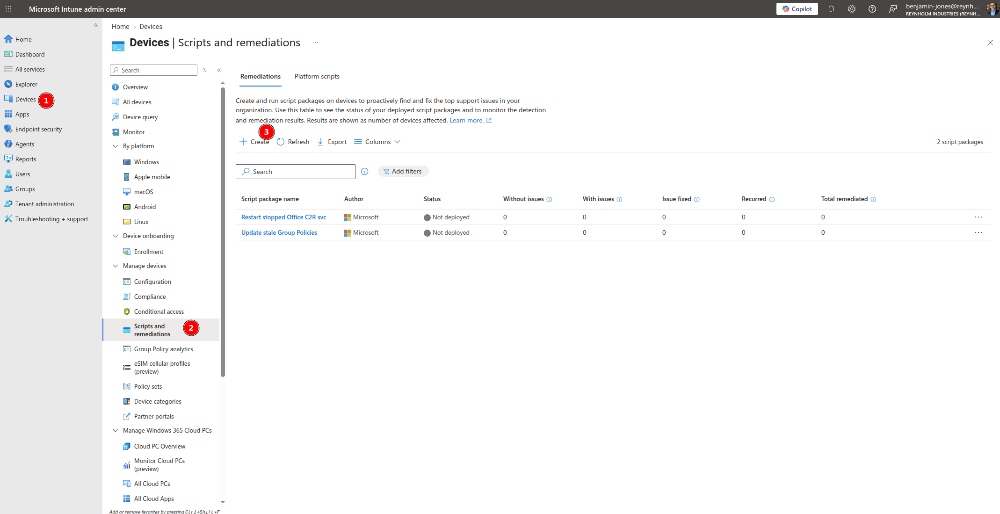
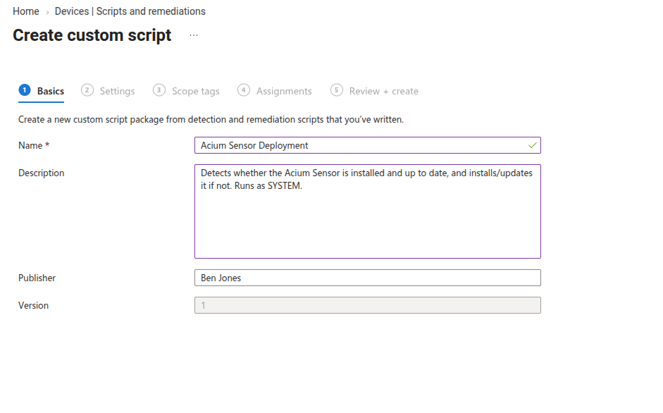
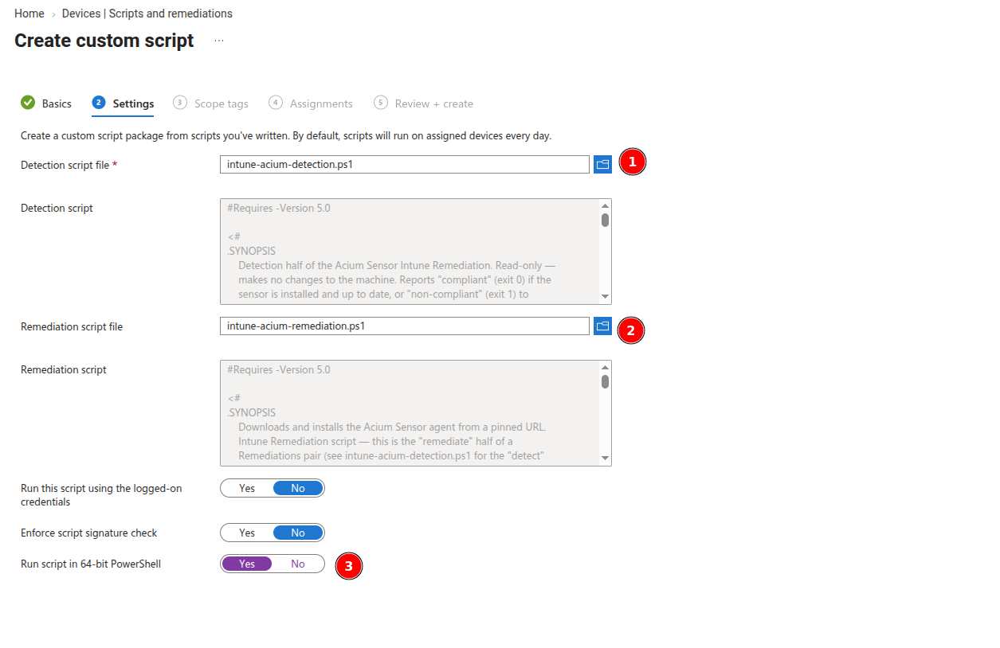
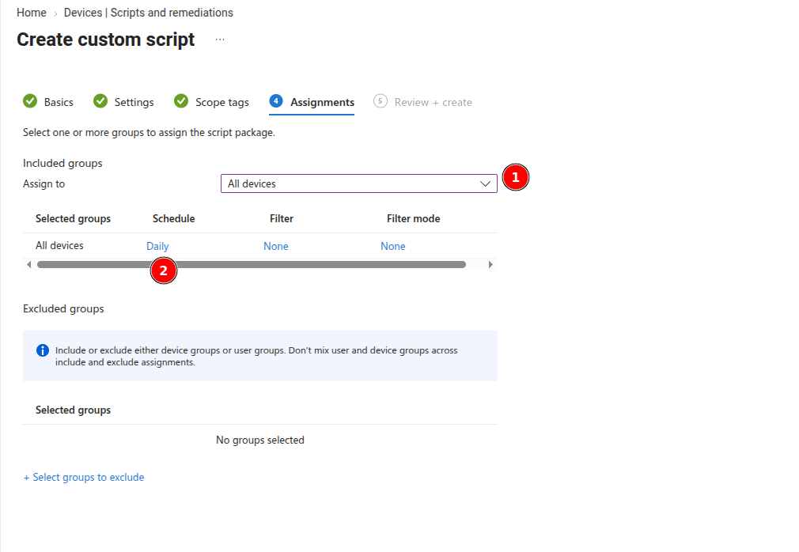
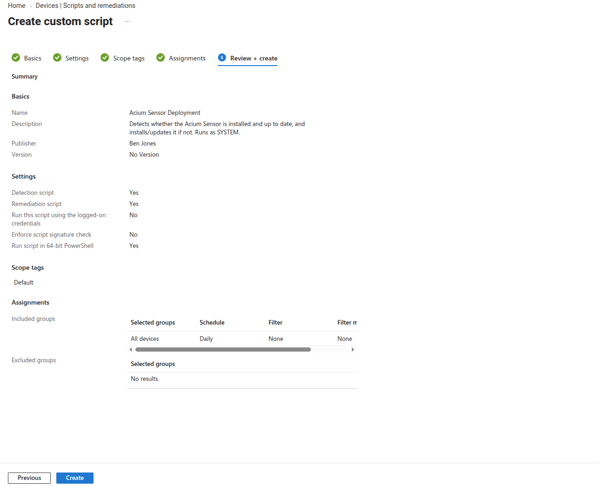
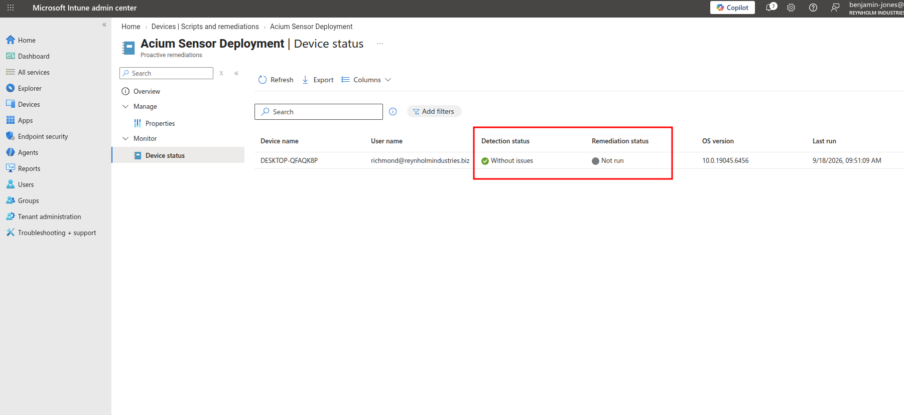

# Acium Sensor — Microsoft Intune Deployment Scripts

> **Status: Untested.** This detection/remediation pair has not yet been run against a live Intune Remediation. Validate it end-to-end in a lab/pilot environment before rolling it out to production endpoints.

This folder contains a pair of PowerShell scripts that install and keep the Acium Sensor up to date across a fleet of Windows endpoints via **Intune Remediations** (Devices > Scripts and remediations > Remediations):

- `intune-acium-detection.ps1` — read-only. Reports whether the sensor is installed and up to date.
- `intune-acium-remediation.ps1` — does the actual work (download, prerequisite check, install).

## Why Remediations, not a plain platform script

Intune has three ways to run a PowerShell script on managed Windows devices, and they're not interchangeable for this use case:

| Mechanism | Recurs? | Fits this deployment? |
|---|---|---|
| **Platform script** (Devices > Scripts) | Runs once per device, then never again unless the script content or assignment changes | No — this repo's whole design is a recurring, idempotent check-and-install |
| **Win32 app** (`.intunewin`) | Install/uninstall/detection-rule model, supersedence for version bumps | Possible, but a heavier packaging process for what is otherwise a simple script |
| **Remediation** (detect + remediate script pair) | Runs on a schedule you define (hourly to daily), plus once immediately on assignment | **Yes** — this is Intune's actual "recurring, idempotent, skip if compliant" primitive, which is exactly what `dattormm-acium.ps1`/`generic-acium.ps1` implement as one script |

So this folder splits the same logic those scripts use into Intune's detect/remediate shape: `intune-acium-detection.ps1` answers "does this device need anything done," and `intune-acium-remediation.ps1` is only invoked by Intune when the answer is no.

## What each script does

**`intune-acium-detection.ps1`** (read-only, makes no changes):
1. Checks whether the `AciumSensor` service (or process, as a fallback) is present. Not installed → non-compliant.
2. If installed, compares the source file's current ETag (from a HEAD request) against the ETag recorded at the last successful install. Unchanged → compliant. Changed, or no prior state recorded → non-compliant.
3. If the server can't be reached for the ETag check, reports compliant for that cycle rather than triggering a remediation run that would just fail the same download.

**`intune-acium-remediation.ps1`** (does the work, only runs when detection reports non-compliant):
1. Takes a machine-wide lock so an overlapping run can't stack.
2. Re-checks the same ETag/install-state signals detection did, plus a post-download SHA256 hash comparison — this script is written to be safe to run standalone too (e.g. "Run remediation script" from the console), not just as a follow-on to detection.
3. Downloads the sensor package, checks for the ASP.NET Core 8.0 Runtime (installing it first if missing — deferring the sensor install to the next run if that needs a reboot), extracts the `.zip`, checks the MSI's Authenticode signature, and installs it silently via `msiexec`.
4. Verifies the sensor is actually present afterward, then saves state and cleans up.

## Configuration

Intune Remediation scripts have **no equivalent of a Component Variable / Script Variable system** — there's no per-deployment parameter UI. So, like `generic/generic-acium.ps1`, all configuration is **hardcoded** in each script between the `EDIT THESE VALUES` markers:

```powershell
$DownloadUrl = 'https://storage.googleapis.com/ebm-sensors-prod/win/acium-sensor-setup-0.16.8.zip'
$Organization = ''
$ExpectedPublisherCN = ''
```

**`$DownloadUrl` must be identical in both scripts.** Detection uses its own copy purely to compare ETags; if the two files disagree, detection can report "compliant" for a version the remediation script would actually install differently. `$Organization` and `$ExpectedPublisherCN` only exist in `intune-acium-remediation.ps1` (detection doesn't need them).

Bumping to a new agent version means editing `$DownloadUrl` in **both files** and re-saving the Remediation in Intune — editing a script's content is what makes Intune re-push it to devices; there is no external variable to update instead.

## Prerequisites

- Devices enrolled in Intune with the Intune Management Extension installed (this happens automatically the first time any Intune script/remediation/Win32 app is assigned).
- Windows with PowerShell 5.1 (Windows PowerShell) or later.
- Outbound HTTPS access from endpoints to your sensor package's download URL and to `aka.ms` (for the ASP.NET Core Runtime installer, only needed on machines that don't already have it).
- A Microsoft Intune Plan 1/Intune Suite license (or equivalent) that includes **Remediations** — check your tenant's licensing if the "Remediations" node isn't visible under Devices > Scripts and remediations.

## Setup in Intune

### 1. Create a new Remediation

**Devices > Scripts and remediations > Remediations > Create**.



### 2. Basics

Give it a **Name** (e.g. `Acium Sensor Deployment`) and a **Description** summarizing what it does.



### 3. Settings — add the scripts

- **Detection script file**: upload `intune-acium-detection.ps1`.
- **Remediation script file**: upload `intune-acium-remediation.ps1`.
- **Run this script using the logged-on credentials**: **No** — this must run as SYSTEM.
- **Enforce script signature check**: **No** — these `.ps1` files aren't Authenticode-signed themselves; this repo's own signature check (`$ExpectedPublisherCN`) is independent of this setting and applies only to the downloaded sensor MSI, not to these deployment scripts. Setting this to Yes will cause Intune to reject the upload.
- **Run script in 64-bit PowerShell**: Yes.



### 4. Assignments

Assign to **All devices** rather than a user group — this is a machine-wide install that runs as SYSTEM regardless of who's logged in, so targeting users (which only applies to a device when that user signs in) is unreliable for shared or unattended machines. Set a schedule — e.g. **Daily**, or hourly if you want faster convergence after a version bump. Intune also runs detection once immediately when the Remediation is first assigned to a device.



### 5. Review + create

Confirm the summary matches what you configured, then click **Create**.



### 6. Check device status

Open the Remediation you created and go to **Monitor > Device status** to see each assigned device's latest run.



**Detection status: Without issues** means detection ran and found the sensor already installed and up to date. **Remediation status: Not run** in that case is expected, not a failure — Intune only invokes the remediation script when detection reports non-compliant, so a healthy device will show "Without issues" / "Not run" indefinitely until something actually changes (a version bump, or the sensor going missing).

## Logs

Both scripts write to the same log, so a device's history reads as one continuous timeline:

| File | What's in it |
|---|---|
| `C:\ProgramData\AciumSensor\Logs\deploy.log` | Combined step-by-step log from both scripts — detection entries are tagged `[detect]`. |
| `C:\ProgramData\AciumSensor\Logs\msi-install.log` | Windows Installer's verbose log for the actual MSI install. |
| `C:\ProgramData\AciumSensor\Install\last-installed.json` | State file recording the ETag and SHA256 of the last successfully installed package — read by both scripts. |

Intune's own console only shows the detection script's `Write-Host` output and the remediation script's exit code for the most recent run — `deploy.log` has the full history.

## Exit codes

Intune's Remediations framework only interprets **0 (compliant/success) vs. non-zero (non-compliant/failed)** — it doesn't surface this repo's specific codes anywhere in the console. They're still useful when reading `deploy.log` directly:

**`intune-acium-detection.ps1`:**

| Code | Meaning |
|---|---|
| `0` | Compliant — sensor installed and ETag matches the last successful install (or the server couldn't be reached this cycle) |
| `1` | Non-compliant — sensor missing, ETag changed, or no prior install state recorded — triggers the remediation script |

**`intune-acium-remediation.ps1`:**

| Code | Meaning |
|---|---|
| `0` | Success — installed, already up to date (no-op), or deferred pending a reboot (see the log for which) |
| `1` | Download failed (sensor package or ASP.NET Core Runtime installer) |
| `2` | Could not secure the working/log directory (ACL hardening failed) — refused to proceed with a privileged install |
| `3` | Install failed (sensor MSI or ASP.NET Core Runtime installer) |
| `4` | Missing or invalid configuration value in the script |
| `5` | Zip extraction failed / `AciumSensorInstall.msi` not found inside the package |
| `6` | MSI failed Authenticode signature verification |

## Known dependencies

- **ASP.NET Core 8.0 Runtime** is required for the sensor service to start. `intune-acium-remediation.ps1` checks for and installs this automatically, but it does add extra time (and a download) the first time it runs on any given machine.
- The sensor's `.zip` package must contain a file named exactly `AciumSensorInstall.msi`.

## Troubleshooting

- **Remediation script exits with code 2**: It couldn't lock down `$LogDir` or `$WorkDir`'s permissions (`Set-Acl`/`Get-Acl` failed), so it refused to proceed rather than stage/execute a privileged MSI in a directory that might still be writable by non-admins. This should be very rare when running as SYSTEM — check `deploy.log` for the exact directory and investigate why an ACL change failed there (endpoint security software, filesystem issue, or an already-tampered-with directory are the likely causes).
- **Remediation never runs even though the sensor isn't installed**: Confirm the Remediation is actually assigned to the device's group and check the device's Remediation status under Devices > Scripts and remediations — a device that hasn't checked in recently won't have run detection yet.
- **Detection keeps reporting non-compliant on every cycle even right after a successful remediation**: Check that `intune-acium-detection.ps1`'s hardcoded `$DownloadUrl` exactly matches `intune-acium-remediation.ps1`'s — a mismatch means detection is comparing against a different (or non-existent) resource and will never see the ETag it's looking for.
- **Install seems to succeed but the sensor doesn't run**: Check whether the ASP.NET Core 8.0 Runtime installed successfully in `deploy.log`, and confirm via `Get-Service AciumSensor` on the endpoint. If the runtime is present and the service still isn't there, check `msi-install.log` for the `Feature: Main; ... Action:` line — if it says `Action: Null` for every component (instead of `Action: Local`), Windows Installer silently did nothing (see the exit-code-3/1638 entry below for why).
- **Install fails with exit code 3 and `msi-install.log` shows error 1638 ("Another version of this product is already installed")**: The sensor's MSI keeps the same `ProductCode` across versions, so Windows Installer refuses a plain reinstall whenever that `ProductCode` is already registered — most commonly because the sensor was installed manually at some point outside this Remediation. `intune-acium-remediation.ps1` checks whether the product is already installed via Windows Installer's own `ProductState` API (look for `$isProductInstalled` in SECTION 8) and only adds `REINSTALL=ALL REINSTALLMODE=vomus` in that case.
- **Remediation script says "deferred" and exits 0 without installing**: The ASP.NET Core Hosting Bundle needed a reboot to finish. This is expected — the script intentionally stops rather than installing the sensor against a runtime that can't start yet. The next Remediation cycle completes the install once the machine has rebooted.
